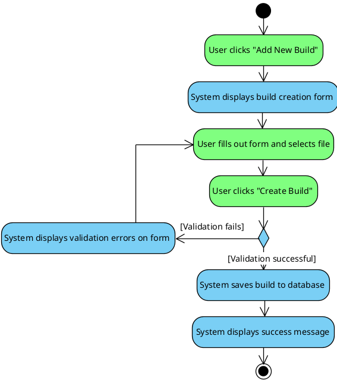
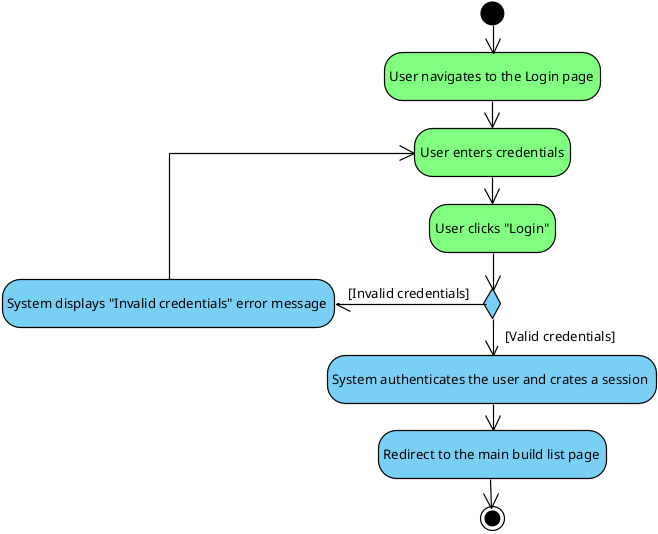
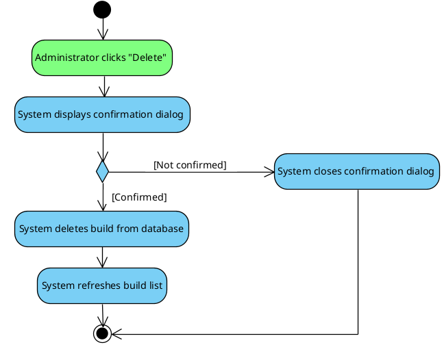

# Activity Diagrams

These diagrams illustrate the step-by-step workflow for key scenarios in the system. They show the flow of control, including actions, decisions, and loops.

### 1. Upload New Build
This activity shows the process of a user creating a new build, including data validation.

### 2. User Login
This activity shows the user authentication process, with branches for successful and failed login attempts.

### 3. Delete Build
This activity shows the process for an administrator deleting a build, including the confirmation step.
