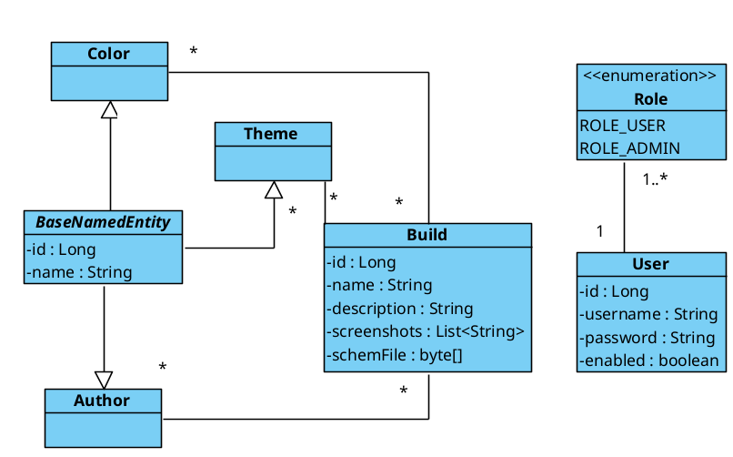

# Domain Model Class Diagram

This diagram describes the main entities (classes) in the "MCBuildLibrary" system, their attributes, and the structural relationships between them. It serves as the foundation for understanding the project's data structure.

## Glossary

Below is a description of each entity presented in the diagram.

*   **Build**
    *   **Description:** The core entity of the system, representing a Minecraft build. It contains a name, description, schematic file (`.schem`), screenshots, and relationships with authors, themes, and colors.

*   **User**
    *   **Description:** A registered user of the application. Possesses credentials (username, password) and a set of roles that define their access rights to system functions.

*   **Role**
    *   **Description:** An enumeration (`enum`) that defines a user's access level (e.g., `ROLE_USER` for a standard user, `ROLE_ADMIN` for an administrator).

*   **BaseNamedEntity**
    *   **Description:** An abstract base class for lookup entities (`Author`, `Theme`, `Color`). It abstracts common logic, such as having a unique identifier (`id`) and a name, to avoid code duplication.

*   **Author**
    *   **Description:** An entity representing the creator (author) of a build. The relationship with `Build` is many-to-many, as one build can have multiple authors, and one author can create many builds.

*   **Theme**
    *   **Description:** An entity describing the style or theme of a build (e.g., "Medieval", "Sci-Fi"). The relationship with `Build` is many-to-many.

*   **Color**
    *   **Description:** An entity describing the primary color or color palette of a build. The relationship with `Build` is many-to-many.