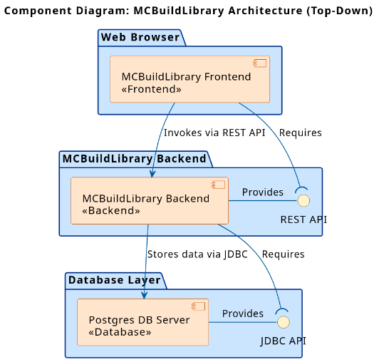

# Component Diagram

This diagram provides a high-level view of the system's software architecture. It shows the main components (Frontend, Backend, Database) and the interfaces they use to communicate with each other.

