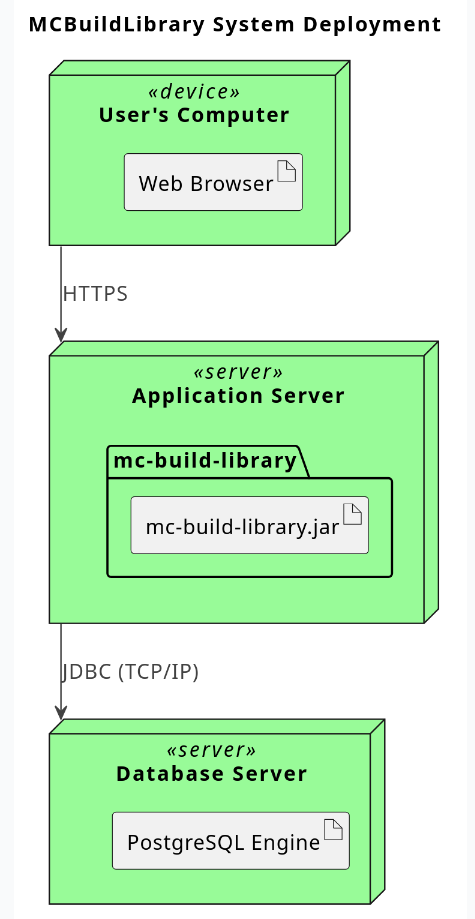

# Deployment Diagram

This diagram illustrates how the software artifacts are deployed onto physical or virtual hardware nodes. It shows the physical architecture of the system, from the user's computer to the application and database servers.

