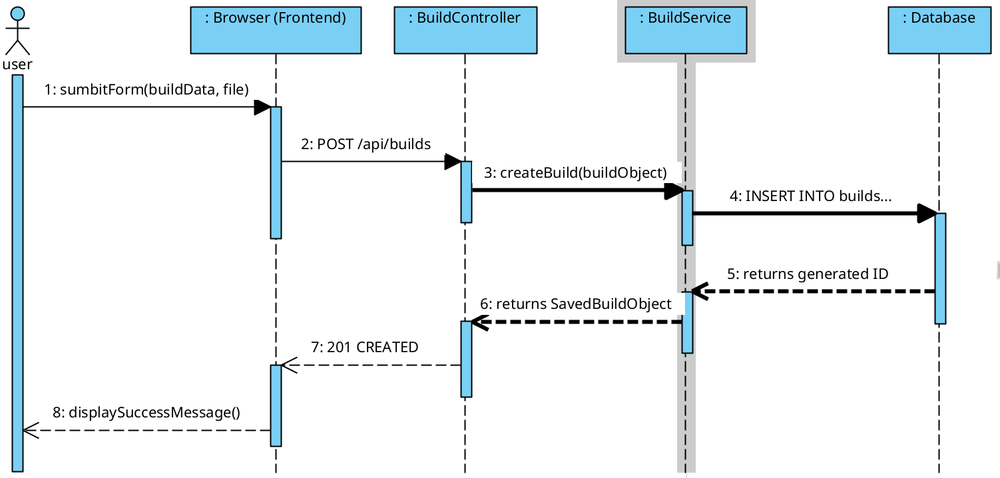
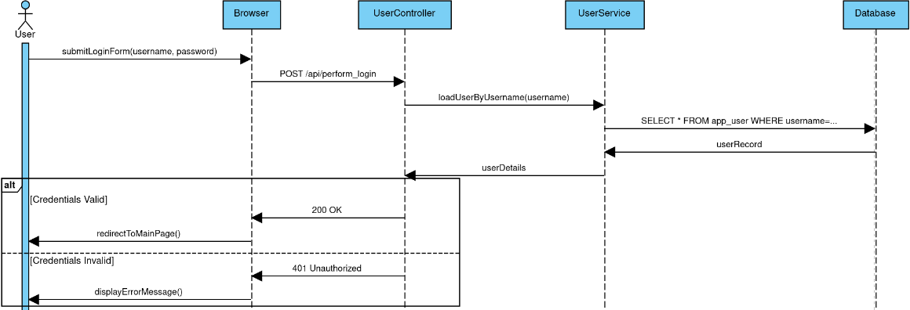
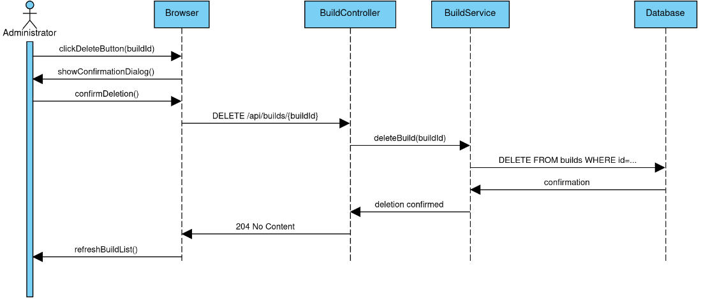

# Sequence Diagrams

These diagrams show the sequence of interactions between system components over time for key scenarios. They illustrate how different parts of the application (frontend, backend, database) collaborate to fulfill a request.

### 1. Upload New Build
This sequence shows how a new build submitted by a user is processed through the controller and service layers to be saved in the database.

### 2. User Login
This sequence shows the authentication flow, including the validation of credentials and the alternative paths for success and failure.

### 3. Delete Build
This sequence shows an administrator deleting a build, from the initial UI click to the final database record removal.
