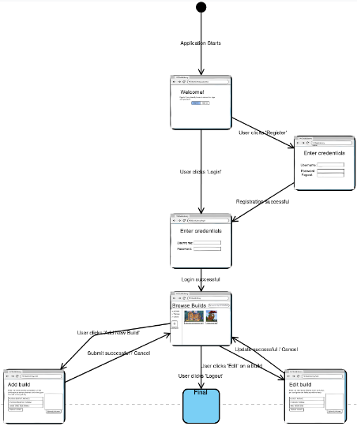

# State Machine Diagram

This diagram models the different states of the application's user interface, based on the provided mockups. It shows how user-triggered events cause transitions between different pages or views (e.g., from the Login Page to the Main Page).

