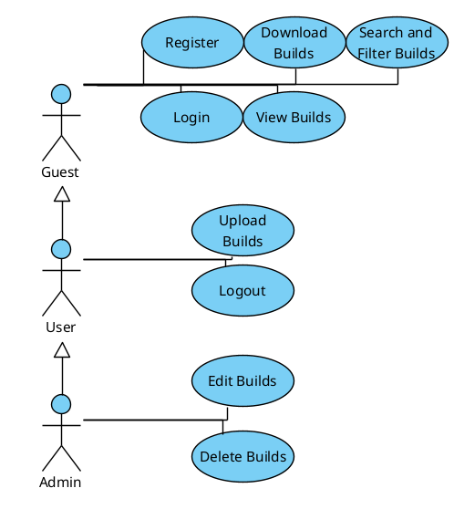

# Use Case Diagram

This diagram illustrates the actors who interact with the system and the actions (use cases) they can perform.

## 1. Actors

| Actor | Description |
| :--- | :--- |
| **Guest** | A user who has not logged into the application. |
| **Registered User** | A user who has successfully registered and logged in. Inherits all capabilities of a Guest. |
| **Administrator** | A user with special privileges for managing the system. Inherits all capabilities of a Registered User. |

## 2. Use Cases (Flow of Events)

### 2.1 View Builds
*   **Description:** Allows any user to see the list of available builds.
*   **Actor:** Guest
*   **Preconditions:** The user has opened the application.
*   **Main Flow:**
    1.  The use case begins when the user navigates to the main page.
    2.  The system requests the first page of builds from the server.
    3.  The server returns a list of builds with their primary information (name, screenshot, authors, etc.).
    4.  The system displays the builds in a grid of cards.
    5.  The use case ends.
*   **Exception Flow E1 (Server Unavailable):**
    1.  If the server does not respond in step 2, the system displays an error message like "Failed to fetch builds. Please try again later."
    2.  The use case ends.

### 2.2 Search & Filter Builds
*   **Description:** Allows any user to find specific builds by searching or applying filters.
*   **Actor:** Guest
*   **Preconditions:** The user is viewing the build list.
*   **Main Flow:**
    1.  The use case begins when the user types a query into the search bar or clicks on a filter item (e.g., an author's name in the sidebar).
    2.  The system sends the search query or filter criteria to the server.
    3.  The server returns a new, filtered list of builds.
    4.  The system updates the grid to display only the builds that match the criteria. If no builds are found, a "No builds found" message is shown.
    5.  The use case ends.

### 2.3 Download Schematic
*   **Description:** Allows any user to download the `.schem` file for a build.
*   **Actor:** Guest
*   **Preconditions:** The user is viewing the build list.
*   **Main Flow:**
    1.  The use case begins when the user clicks the "Download" icon on a build card.
    2.  The system requests the schematic file from the server for that specific build.
    3.  The server sends the file.
    4.  The browser prompts the user to save the `.schem` file to their computer.
    5.  The use case ends.
*   **Exception Flow E1 (File Not Found):**
    1.  If the server cannot find the schematic file in step 3, it returns an error.
    2.  The system displays an alert to the user, such as "Schematic file for this build is missing."
    3.  The use case ends.

### 2.4 Register Account
*   **Description:** Allows a Guest to create a new account.
*   **Actor:** Guest
*   **Preconditions:** The user is not logged in.
*   **Main Flow:**
    1.  The use case begins when the Guest navigates to the Register page.
    2.  The system displays a form with fields for "username", "password", and "confirm password".
    3.  The user enters their desired credentials and submits the form.
    4.  The system validates the input (e.g., username is not taken, passwords match, password meets complexity requirements).
    5.  The system creates a new user account in the database with the `ROLE_USER` role.
    6.  The system displays a "Registration successful!" message and redirects the user to the Login page.
    7.  The use case ends.
*   **Exception Flow E1 (Validation Fails):**
    1.  If validation fails in step 4, the system displays specific error messages (e.g., "Username already taken", "Passwords do not match").
    2.  The user remains on the registration form. The use case continues from step 3.

### 2.5 Login
*   **Description:** Allows a user to authenticate and gain access to features for registered users.
*   **Actor:** Guest
*   **Preconditions:** The user is not currently logged in.
*   **Main Flow:**
    1.  The use case begins when the Guest navigates to the Login page.
    2.  The system displays fields for "username" and "password".
    3.  The user enters their credentials and clicks "Sign In".
    4.  The system validates the credentials against the database.
    5.  If validation is successful, the system establishes a session for the user, granting them the "Registered User" role (or "Administrator" if applicable).
    6.  The system redirects the user to the main build library page.
    7.  The use case ends.
*   **Exception Flow E1 (Invalid Credentials):**
    1.  If the system determines the credentials are incorrect in step 4, it displays an "Invalid username or password" error message.
    2.  The user remains on the Login page. The use case continues from step 3.

### 2.6 Logout
*   **Description:** Allows an authenticated user to end their session.
*   **Actor:** Registered User
*   **Preconditions:** The user is currently logged in.
*   **Main Flow:**
    1.  The use case begins when the user clicks the "Logout" button.
    2.  The system sends a request to the server to terminate the session.
    3.  The server invalidates the user's session.
    4.  The system redirects the user to the main page, now in a "Guest" state.
    5.  The use case ends.

### 2.7 Upload New Build
*   **Description:** Allows a Registered User to add a new build to the library.
*   **Actor:** Registered User
*   **Preconditions:** The user is authenticated as a "Registered User" or "Administrator".
*   **Main Flow:**
    1.  The use case begins when the user clicks the "Add New Build" button.
    2.  The system displays the build creation form with fields for Name, Authors, Themes, Colors, Description, Screenshot URLs, and a file upload button for the schematic.
    3.  The user fills out the required fields and selects a `.schem` file.
    4.  The user clicks the "Create Build" button.
    5.  The system validates the submitted data (e.g., checks for required fields, ensures the build name is unique).
    6.  The system saves the new build's information and schematic file to the database.
    7.  The system displays a success message and refreshes the build list to show the new build.
    8.  The use case ends.
*   **Alternative Flow A1 (User Cancels):**
    1.  At any point before step 4, the user can click the "Cancel" button.
    2.  The system hides the form and returns the user to the main build list.
    3.  The use case ends.
*   **Exception Flow E1 (Validation Fails):**
    1.  If validation fails in step 5, the system displays specific error messages next to the invalid fields (e.g., "Build name already exists", "At least one author is required").
    2.  The user remains on the form. The use case continues from step 3.

### 2.8 Edit Build
*   **Description:** Allows an Administrator to modify the details of an existing build.
*   **Actor:** Administrator
*   **Preconditions:** The user is authenticated as an "Administrator".
*   **Main Flow:**
    1.  The use case begins when the Administrator clicks the "Edit" icon on a build card.
    2.  The system displays the build form, pre-filled with the existing data for that build.
    3.  The Administrator modifies the desired fields.
    4.  The Administrator clicks the "Update Build" button.
    5.  The system validates the new data.
    6.  The system saves the updated information to the database.
    7.  The system displays a success message and refreshes the build list to show the updated build.
    8.  The use case ends.
*   **Alternative Flow A1 (Admin Cancels):**
    1.  At any point before step 4, the Administrator can click "Cancel".
    2.  The system hides the form without saving changes. The use case ends.

### 2.9 Delete Build
*   **Description:** Allows an Administrator to permanently remove a build from the library.
*   **Actor:** Administrator
*   **Preconditions:** The user is authenticated as an "Administrator".
*   **Main Flow:**
    1.  The use case begins when the Administrator clicks the "Delete" icon on a specific build card.
    2.  The system displays a confirmation dialog (e.g., "Are you sure you want to delete this build?").
    3.  The Administrator confirms the action.
    4.  The system sends a request to the server to delete the build.
    5.  The server removes the build and all its associated data from the database.
    6.  The system refreshes the build list, and the deleted build is no longer visible.
    7.  The use case ends.
*   **Alternative Flow A1 (Admin Cancels):**
    1.  If the Administrator cancels the action in step 3, the system closes the confirmation dialog.
    2.  No changes are made. The use case ends.

### 2.10 Manage Metadata
*   **Description:** Allows an Administrator to edit or delete metadata items (Authors, Themes, Colors).
*   **Actor:** Administrator
*   **Preconditions:** The user is authenticated as an "Administrator".
*   **Main Flow (Editing):**
    1.  The use case begins when the Administrator clicks the "Edit" icon next to an author, theme, or color in the filter sidebar.
    2.  The item's name becomes an editable text field.
    3.  The Administrator types a new name and presses Enter or clicks a "Save" icon.
    4.  The system validates the new name (e.g., not blank, not a duplicate).
    5.  The system updates the item's name in the database.
    6.  The sidebar refreshes with the new name.
    7.  The use case ends.
*   **Main Flow (Deleting):**
    1.  The use case begins when the Administrator clicks the "Delete" icon next to an author, theme, or color.
    2.  The system displays a confirmation dialog.
    3.  The Administrator confirms the deletion.
    4.  The system checks if the item is associated with any builds.
    5.  If there are no associations, the system deletes the item from the database.
    6.  The sidebar refreshes, and the item is gone.
    7.  The use case ends.
*   **Exception Flow E1 (Cannot Delete Associated Item):**
    1.  If the check in step 5 of the Deleting flow finds that the item is in use, the system displays an error message (e.g., "Cannot delete 'Medieval' because it is used by 5 builds.").
    2.  The deletion is aborted. The use case ends.