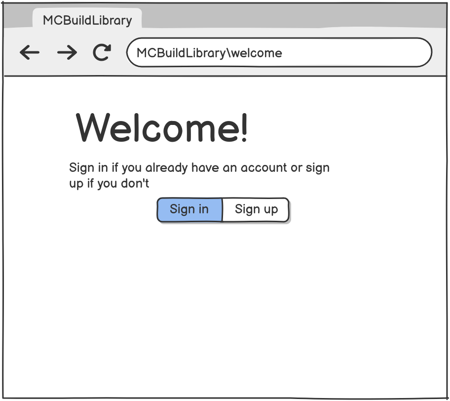
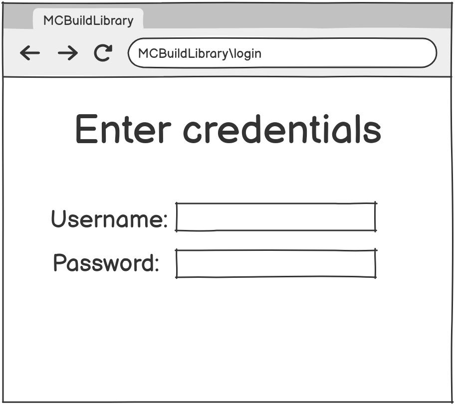
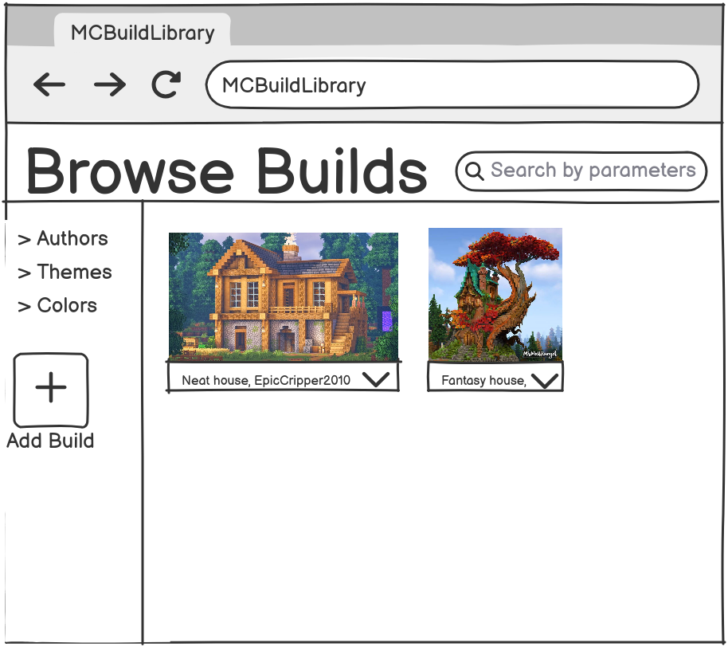
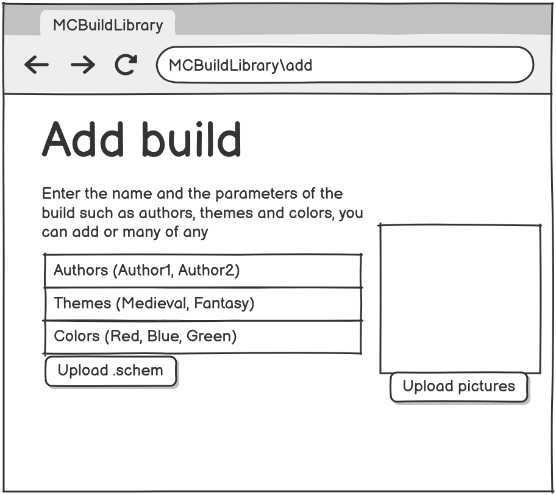
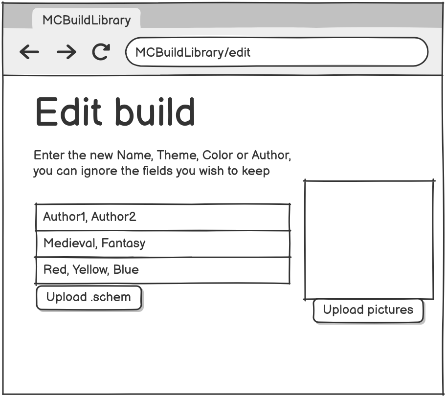

# SRC.md: Minecraft Build Library

## Table of Contents
- [1. Introduction](#1-introduction)
- [2. User Requirements](#2-user-requirements)
    - [2.1 Software Interfaces](#21-software-interfaces)
    - [2.2 User Interfaces](#22-user-interfaces)
    - [2.3 User Characteristics](#23-user-characteristics)
    - [2.4 Assumptions and Dependencies](#24-assumptions-and-dependencies)
- [3. System Requirements](#3-system-requirements)
    - [3.1 Functional Requirements](#31-functional-requirements)
    - [3.2 Non-Functional Requirements](#32-non-functional-requirements)

## 1. Introduction

This document outlines the requirements for the **Minecraft Build Library**, a full-stack web application.

The primary purpose of this software is to provide a centralized platform for the Minecraft community to share, discover, and download build schematics (`.schem` files). The application will allow users to upload their creations, categorize them with relevant metadata such as authors, themes, and colors, and browse a filterable, searchable library of builds submitted by the community.

The software **will**:
*   Provide a web-based user interface for all interactions.
*   Allow user registration and authentication to manage content.
*   Enable the upload and download of Minecraft build schematic files.
*   Store and manage metadata (authors, themes, colors) associated with each build.
*   Offer robust search and filtering capabilities.
*   Differentiate between standard users and administrators for content management.

The software **will not**:
*   Function as a Minecraft game server or client.
*   Provide tools for creating or editing Minecraft builds or schematics.
*   Host user-generated content other than schematic files and their associated metadata (e.g., it will not host world files or mods).

## 2. User Requirements

### 2.1 Software Interfaces

The software product interacts with the following external systems:

*   **PostgreSQL Database:** The application uses a PostgreSQL database for all data persistence, including user accounts, builds, and metadata. It interfaces with the database via the Java Persistence API (JPA) with Hibernate as the implementation.
*   **Web Browser (Client):** The backend exposes a RESTful API over HTTP/S. The frontend, a Single Page Application (SPA), interacts with this API to retrieve and manipulate data.

### 2.2 User Interfaces

The application provides a graphical user interface (GUI) accessible through a standard web browser. The key user interactions are:

*   **Home/Builds View:** A paginated gallery of all submitted builds, serving as the main landing page for authenticated users.
*   **Filtering Sidebar:** A persistent sidebar allowing users to filter the build list by authors, themes, or colors.
*   **Search Bar:** A global search bar for finding builds based on name or associated metadata.
*   **Build Details:** Clicking on a build will display its full details, including name, description, authors, themes, colors, screenshots, and a download link for the schematic file.
*   **User Authentication:** Separate pages/modals for user registration and login.
*   **Build Submission/Editing Form:** A form for authenticated users to upload new builds or for administrators to edit existing ones. This form includes fields for all required metadata and a file uploader for the `.schem` file.
*   **Administrative Controls:** Administrators have additional UI elements (e.g., edit/delete buttons) on builds and metadata items in the filtering sidebar.

#### UI Mockups
This section contains visual mockups of the application's key user interfaces.

##### Welcome / Landing Page
*This is the initial page a user sees before logging in, encouraging them to register or sign in.*

##### Login Page
*The form for existing users to authenticate.*

##### Register Page
*The form for new users to create an account.*

##### Main Page (Builds View)
*The primary view for an authenticated user, showing the gallery of builds and the filter sidebar.*

##### Add Build Page
*The form interface for uploading a new build and its metadata.*
)

##### Edit Build Page
*The same form as "Add Build," but pre-populated with an existing build's data for an administrator to modify.*
)

### 2.3 User Characteristics

The intended users of the product fall into two main categories:

*   **Standard User (`ROLE_USER`):** This user is a typical Minecraft player or enthusiast. Their primary goal is to browse, search for, and download builds, or to share their own creations with the community. They are expected to have general web browsing experience but no specialized technical expertise.
*   **Administrator (`ROLE_ADMIN`):** This user is responsible for content moderation and system maintenance. They have all the capabilities of a Standard User, plus the ability to edit and delete any build, manage all metadata (authors, themes, colors), and perform bulk operations. This user is expected to be technically proficient and have a thorough understanding of the application's purpose.

### 2.4 Assumptions and Dependencies

*   **Assumption:** Users will access the application through a modern web browser with JavaScript enabled.
*   **Assumption:** The application is hosted on a server environment capable of running Java 17+ and Docker.
*   **Dependency:** The application requires a running and accessible PostgreSQL database instance for its operation.
*   **Dependency:** The backend relies on the Spring Boot framework and its associated libraries for core functionality.
*   **Dependency:** The frontend is built using the React library and Material UI component library.

## 3. System Requirements

### 3.1 Functional Requirements

#### FR1: User Management
*   **FR1.1:** The system shall allow a new user to register with a unique username and a password.
*   **FR1.2:** The system shall allow a registered user to log in.
*   **FR1.3:** The system shall provide role-based access control, distinguishing between `ROLE_USER` and `ROLE_ADMIN`.
*   **FR1.4:** An authenticated user shall be able to log out.

#### FR2: Build Management
*   **FR2.1:** Any user (authenticated or not) shall be able to view a paginated list of all builds.
*   **FR2.2:** Any user shall be able to view the detailed information for a single build, including its name, description, authors, themes, colors, and screenshots.
*   **FR2.3:** Any user shall be able to download the `.schem` file associated with a build.
*   **FR2.4:** An authenticated user (`ROLE_USER` or `ROLE_ADMIN`) shall be able to create a new build by providing a name, one or more authors, themes, colors, and a `.schem` file. A description and screenshot URLs are optional.
*   **FR2.5:** An administrator (`ROLE_ADMIN`) shall be able to update the metadata and schematic file of any existing build.
*   **FR2.6:** An administrator (`ROLE_ADMIN`) shall be able to delete any build.

#### FR3: Search and Filtering
*   **FR3.1:** Any user shall be able to filter the build list by selecting a specific author, theme, or color.
*   **FR3.2:** Any user shall be able to perform a text-based search that filters builds by name, author, theme, or color.

#### FR4: Metadata Management
*   **FR4.1:** An administrator (`ROLE_ADMIN`) shall be able to create, update, and delete authors, themes, and colors.
*   **FR4.2:** The system shall prevent the deletion of themes or colors that are currently associated with one or more builds.
*   **FR4.3:** Deleting an author who is the sole author of a build shall result in the deletion of that build.
*   **FR4.4:** An administrator (`ROLE_ADMIN`) shall be able to perform a bulk creation of multiple authors, themes, and colors in a single operation.

#### FR5: Asynchronous Operations
*   **FR5.1:** An authenticated user shall be able to request the generation of a detailed text log file for any build. This process shall run asynchronously.
*   **FR5.2:** The user shall be able to check the status of the log generation task (e.g., PENDING, COMPLETED, FAILED).
*   **FR5.3:** Once the task is complete, the user shall be able to download the generated log file.

### 3.2 Non-Functional Requirements

#### 3.2.1 SOFTWARE QUALITY ATTRIBUTES

*   **Security:**
    *   **Why it's important:** To protect user accounts from unauthorized access and to prevent unauthorized modification or deletion of content.
    *   **Implementation:** The system uses Spring Security for authentication and authorization. Passwords are securely hashed using BCrypt. Cross-Site Request Forgery (CSRF) protection is enabled for all state-changing requests. Endpoint access is restricted based on user roles (`ROLE_USER`, `ROLE_ADMIN`).
    *   **Measurement:** Security will be measured through code reviews focused on security best practices and periodic vulnerability scanning.

*   **Performance:**
    *   **Why it's important:** To ensure a responsive and smooth user experience, especially when browsing large numbers of builds.
    *   **Implementation:** The system employs an in-memory cache (`InMemoryCache`) to store frequently accessed entities (builds, authors, themes, colors) and query results, reducing database load. API endpoints that return lists of data are paginated to ensure efficient data transfer.
    *   **Measurement:** Performance will be measured by ensuring API response times for common read operations remain under 500ms under normal load.

*   **Reliability:**
    *   **Why it's important:** The application must be consistently available and perform its functions correctly to be a trusted resource for the community.
    *   **Implementation:** Database operations are managed within transactions (`@Transactional`) to ensure data integrity and consistency. A comprehensive logging setup (`Logback`) is in place to capture errors and application behavior for easier debugging and monitoring.
    *   **Measurement:** Reliability will be measured by monitoring application uptime and tracking the rate of unhandled exceptions in the production logs.

*   **Maintainability:**
    *   **Why it's important:** The codebase should be easy to understand, modify, and extend to facilitate future development and bug fixes.
    *   **Implementation:** The backend follows a standard three-tier architecture (Controller, Service, Repository), promoting a clear separation of concerns. Aspect-Oriented Programming (AOP) is used for cross-cutting concerns like logging, keeping business logic clean. The frontend is structured into reusable React components.
    *   **Measurement:** Maintainability will be assessed through code complexity metrics and the ease with which a new developer can understand and contribute to the project.